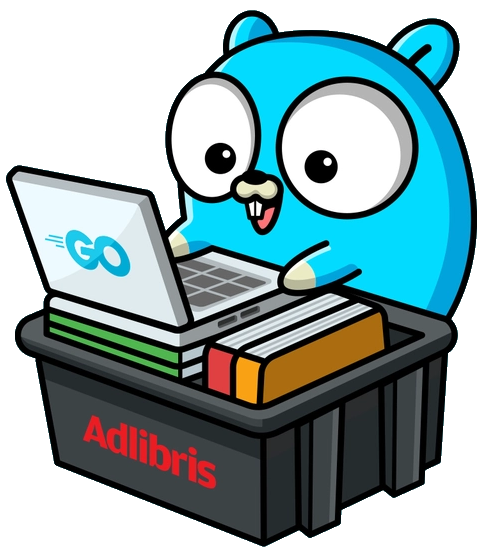

<!-- Improved compatibility of back to top link: See: https://github.com/vinpel/golang-sample-api-jwt/pull/73 -->
<a name="readme-top"></a>
<!--
*** Thanks for checking out the Best-README-Template. If you have a suggestion
*** that would make this better, please fork the repo and create a pull request
*** or simply open an issue with the tag "enhancement".
*** Don't forget to give the project a star!
*** Thanks again! Now go create something AMAZING! :D
-->


<!-- PROJECT SHIELDS -->
<!--
*** I'm using markdown "reference style" links for readability.
*** Reference links are enclosed in brackets [ ] instead of parentheses ( ).
*** See the bottom of this document for the declaration of the reference variables
*** for contributors-url, forks-url, etc. This is an optional, concise syntax you may use.
*** https://www.markdownguide.org/basic-syntax/#reference-style-links
-->

[![Issues][issues-shield]][issues-url]
[![MIT License][license-shield]][license-url]
[![LinkedIn][linkedin-shield]][linkedin-url]


<!-- PROJECT LOGO -->
<br />
<div align="center">
  <a href="https://github.com/vinpel/golang-sample-api-jwt">
    
  </a>

  <h3 align="center">golang-sample-api-jwt</h3>

  <p align="center">
    A sample golang api to test, learn and have reference for implementing stuff
    <br />
    <a href="https://github.com/vinpel/golang-sample-api-jwt"><strong>Explore the docs »</strong></a>
    <br />
    <br />
    <a href="https://github.com/vinpel/golang-sample-api-jwt">View Demo</a>
    ·
    <a href="https://github.com/vinpel/golang-sample-api-jwt/issues">Report Bug</a>
    ·
    <a href="https://github.com/vinpel/golang-sample-api-jwt/issues">Request Feature</a>
  </p>
</div>


<!-- TABLE OF CONTENTS -->
<details>
  <summary>Table of Contents</summary>
  <ol>
    <li>
      <a href="#about-the-project">About The Project</a>
      <ul>
        <li><a href="#built-with">Built With</a></li>
      </ul>
    </li>
    <li>
      <a href="#getting-started">Getting Started</a>
      <ul>
        <li><a href="#prerequisites">Prerequisites</a></li>
        <li><a href="#installation">Installation</a></li>
      </ul>
    </li>
    <li><a href="#usage">Usage</a></li>
    <li><a href="#roadmap">Roadmap</a></li>
    <li><a href="#contributing">Contributing</a></li>
    <li><a href="#license">License</a></li>
    <li><a href="#contact">Contact</a></li>
    <li><a href="#acknowledgments">Acknowledgments</a></li>
  </ol>
</details>


<!-- ABOUT THE PROJECT -->
## About The Project


I wanted to build a test golang application able to :
 * Connect to a mySQL database via gorm to store user data
 * Use the Gin Web Framework to serve API
 * Secure API via 2 JWT different token usage :
    * a short lived "access token" (1 hour ) to use the API
    * a long **refresh**  JWT token (15 days ), only able to get new up-to-date access and refresh token
 * Document the API via the Swagger UI


<p align="right">(<a href="#readme-top">back to top</a>)</p>


### Built With


* [![Go][Go-badge]][Go-url]
* [![Gin][Gin-badge]][Gin-url]
* [![Swaggo][Swaggo-badge]][Swaggo-url] generate from anotations Swagger UI pages


<p align="right">(<a href="#readme-top">back to top</a>)</p>


<!-- GETTING STARTED -->
## Getting Started
.

### Prerequisites


* go
* a mySQL database, use the one provided in docker or edit the main.go file
  ```sh
  docker-compose up
  ```

### Installation

_Below is an example of how you can instruct your audience on installing and setting up your app. This template doesn't rely on any external dependencies or services._


1. Clone the repo
   ```sh
   git clone https://github.com/vinpel/golang-sample-api-jwt.git
   ```
2. Install dependencies and build the app
   ```sh
   go build .
   ```
4. Start the app
   ```js
   go run .
   ```

<p align="right">(<a href="#readme-top">back to top</a>)</p>


<!-- USAGE EXAMPLES -->
## Usage

* Consult the API documentation
   
   http://localhost:8000/swagger/index.html

* View the database content (db / root / root)
   
   http://localhost:8080

* Launch a debug session : F5 in VScode

* Stop a debug session : SHIFT + F5 in VScode

* Recreate the swagger documentation and start the application
```sh
  swag init && go run .
```

* Set the application in production mode (disable swagger endpoint)
   1. edit  the **main.go** file
   2. add the following line before the routeur initilisation

```go
gin.SetMode(gin.ReleaseMode)

```
   3. restart / build / install the app
```sh
   go build .
```

<p align="right">(<a href="#readme-top">back to top</a>)</p>


<!-- ROADMAP -->
## Roadmap

- [x] Add Gin Framework
- [x] Add API endpoint to create a new user
- [x] Add Swaggo annotations to generate swagger json/yaml file
- [x] Add API endpoint to grab JWT tokens using user information email/passwod
- [x] Add API endpoint to grab JWT tokens from a refresh token
- [x] Add API **secure** endpoint to test the secure API (ping)
- [x] Change password algorithm to Argon 2 
- [X] Add secure API to change the password (stay connected for other / disconnect)
- [ ] Manage configuration  [https://github.com/spf13/viper](https://github.com/spf13/viper)
- [ ] Add tests with [ovh-venom](https://github.com/ovh/venom)


See the [open issues](https://github.com/vinpel/golang-sample-api-jwt/issues) for a full list of proposed features (and known issues).

<p align="right">(<a href="#readme-top">back to top</a>)</p>


<!-- CONTRIBUTING -->
## Contributing

Contributions are what make the open source community such an amazing place to learn, inspire, and create. Any contributions you make are **greatly appreciated**.

If you have a suggestion that would make this better, please fork the repo and create a pull request. You can also simply open an issue with the tag "enhancement".
Don't forget to give the project a star! Thanks again!

1. Fork the Project
2. Create your Feature Branch (`git checkout -b feature/AmazingFeature`)
3. Commit your Changes (`git commit -m 'Add some AmazingFeature'`)
4. Push to the Branch (`git push origin feature/AmazingFeature`)
5. Open a Pull Request

<p align="right">(<a href="#readme-top">back to top</a>)</p>


<!-- LICENSE -->
## License

Distributed under the MIT License. See `LICENSE.txt` for more information.

<p align="right">(<a href="#readme-top">back to top</a>)</p>


<!-- CONTACT -->
## Contact

Vincent Pélisset - [@g4spine](https://twitter.com/g4spine) 

Project Link: [https://github.com/vinpel/golang-sample-api-jwt](https://github.com/golang-sample-api-jwt)

<p align="right">(<a href="#readme-top">back to top</a>)</p>


<!-- ACKNOWLEDGMENTS -->
## Acknowledgments

Use this space to list resources you find helpful and would like to give credit to. I've included a few of my favorites to kick things off!

* [Best-README-Template](https://github.com/vinpel/golang-sample-api-jwt)
* [Img Shields](https://shields.io)
* [GitHub Pages](https://pages.github.com)
* [Gopher image](https://dribbble.com/shots/18090283-Gopher-with-Laptop)

<p align="right">(<a href="#readme-top">back to top</a>)</p>


<!-- MARKDOWN LINKS & IMAGES -->
<!-- https://www.markdownguide.org/basic-syntax/#reference-style-links -->
[issues-shield]: https://img.shields.io/github/issues/vinpel/golang-sample-api-jwt.svg?style=for-the-badge
[issues-url]: https://github.com/vinpel/golang-sample-api-jwt/issues
[license-shield]: https://img.shields.io/github/license/vinpel/golang-sample-api-jwt.svg?style=for-the-badge
[license-url]: https://github.com/vinpel/golang-sample-api-jwt/blob/master/LICENSE.txt
[linkedin-shield]: https://img.shields.io/badge/-LinkedIn-black.svg?style=for-the-badge&logo=linkedin&colorB=555
[linkedin-url]: https://www.linkedin.com/in/vincent-p%C3%A9lisset/
[product-screenshot]: docs/images/product-screenshot.png

[Gin-badge]: https://img.shields.io/badge/gin-000000?style=for-the-badge&logo=coronaengine&logoColor=white
[Go-url]: https://go.dev
[Go-badge]: https://img.shields.io/badge/go-02DBFF?style=for-the-badge&logo=go&logoColor=black
[Gin-url]: https://github.com/gin-gonic/gin/
[Swaggo-badge]: https://img.shields.io/badge/Swaggo-EBEBC4?style=for-the-badge&logo=Swagger&logoColor=grey
[Swaggo-url]: https://github.com/swaggo/swag

